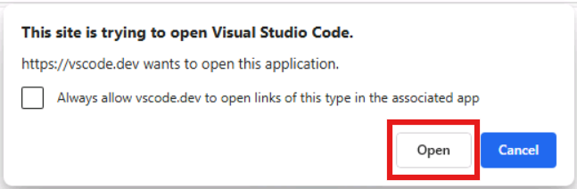
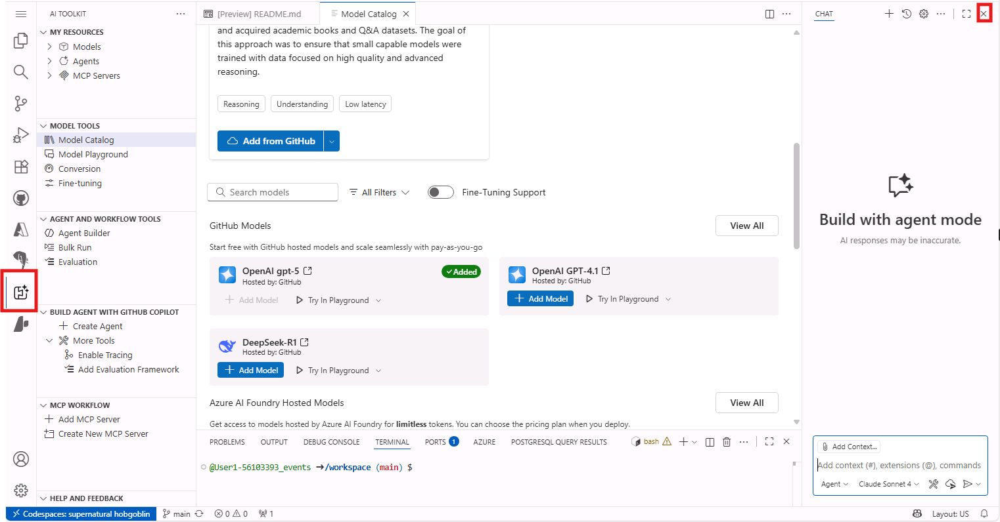
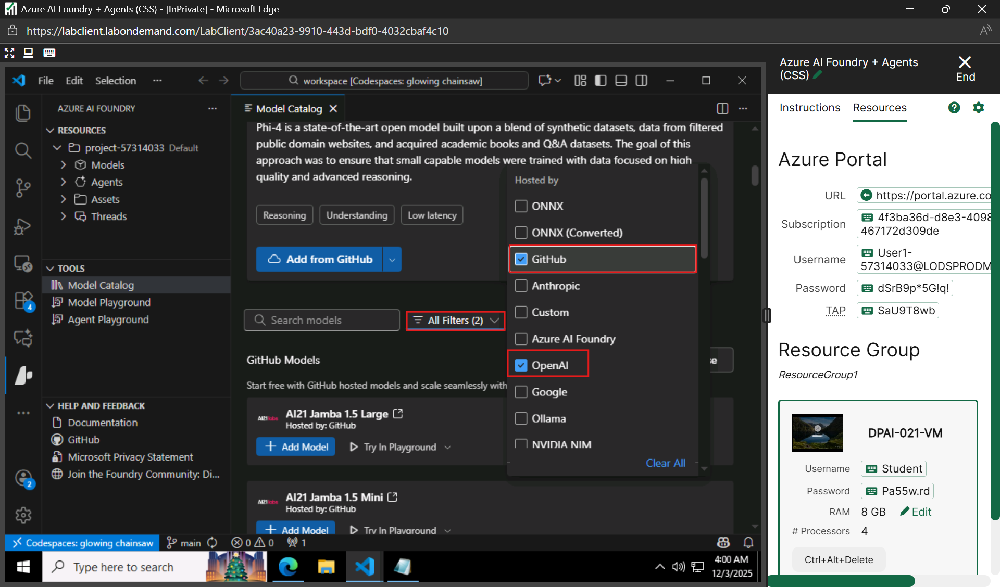
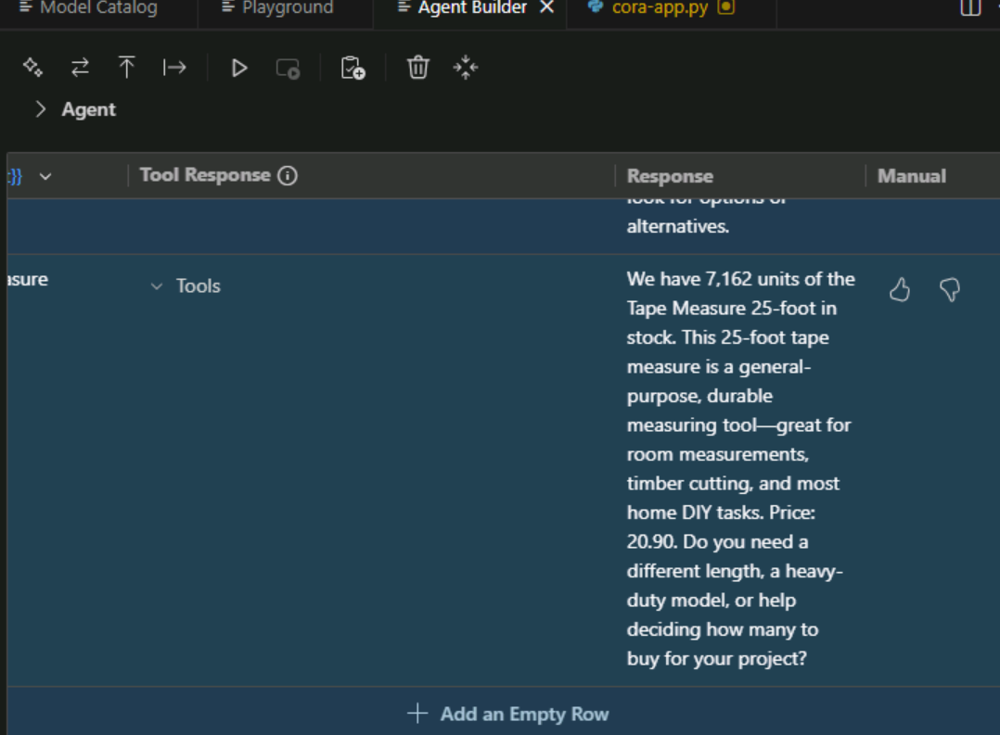

# Usecase 03- Prototyping multimodal agents with Microsoft Foundry and the AI Toolkit

## Scenario

In this Usecase, you'll be building an AI agent for Zava, a leading DIY
(Do-It-Yourself) retail company that operates both online e-commerce and
multiple physical stores across the United States. Zava specializes in
home improvement, hardware, tools, and DIY project supplies, serving
customers who range from weekend hobbyists to professional contractors.

**Introduction**

As organizations adopt AI-driven solutions, the ability to rapidly
prototype intelligent, multimodal agents has become essential. In this
use case, you will build a fully functional AI agent for **Zava**, a
leading DIY retail brand that operates both online and in stores across
the U.S. Using **Microsoft Foundry**, **Azure AI**, and the **AI Toolkit
in GitHub Codespaces**, you will design, test, and refine a multimodal
assistant capable of understanding text, analyzing images, and
retrieving product information using real-time tools.

This hands-on lab guides you through the entire lifecycle of agent
development—from exploring and selecting AI models, to augmenting them
with grounding data, to integrating tools via MCP (Model Context
Protocol), and finally migrating the agent into code. By the end, you
will gain practical experience in building enterprise-ready agents that
combine reasoning, image understanding, and tool usage to deliver
personalized customer support for Zava’s DIY customers.

**Objectives**

- Understand how to deploy the required Azure infrastructure for
  multimodal agent development.

- Launch and work within a cloud-hosted GitHub Codespaces environment
  preconfigured for AI prototyping.

- Explore and compare multimodal AI models using the AI Toolkit Model
  Catalog.

- Select an appropriate Foundry-hosted model for building an
  enterprise-ready AI agent.

- Augment the model using system prompts and grounding data to improve
  task relevance and accuracy.

- Test multimodal capabilities such as text understanding and image
  analysis in the Model Playground.

- Build the Cora agent using Agent Builder with customized instructions
  and personality traits.

- Integrate MCP-based tools to enable real-time product search and data
  retrieval.

- Validate the agent’s behavior by interacting with it using multimodal
  prompts.

- Export the agent into SDK-generated Python code for application
  integration.

- Perform manual evaluations of agent responses using structured test
  cases in Agent Builder.

**Prerequisites**

- **GitHub Account**: You are expected to have your own GitHub login
  credentials.  
  If you do not have an account, please create one by visiting:  
  +++https://github.com/signup+++

## Task 0: Understand the VM and the credentials

In this task, we will identify and understand the credentials that we
will be using throughout the lab.

1.  **Instructions** tab hold the lab guide with the instructions to be
    followed throughout the lab.

2.  **Resources** tab has got the credentials that will be needed for
    executing the lab.

    - **URL** – URL to the Azure portal

    - **Subscription** – This is the ID of the subscription assigned to
      you

    - **Username** – The user id with which you need to login to the
      Azure services.

    - **Password** – Password to the Azure login. Let us call this
      Username and password as Azure login credentials. We will use
      these creds wherever we mention Azure login credentials.

    - **Resource Group** – The **Resource group** assigned to you.


3.  **Help** tab holds the Support information. The **ID** value here is
    the **Lab instance ID** which will be used during the lab execution.

> 

\[!Alert\] **Important:** Make sure you create all your resources under
this Resource group

## Task 1: Deploy infrastructure from template

1.  Open a browser go to +++https://portal.azure.com+++ and sign in with
    your cloud slice account below.

Username: <+++@lab.CloudPortalCredential>(User1).Username+++

Password: <+++@lab.CloudPortalCredential>(User1). *TAP*+++

> 
>
> 

2.  Open a new browser and enter the following URL in the address bar:
    +++
    https://portal.azure.com/#create/Microsoft.Template/uri/https%3A%2F%2Fraw.githubusercontent.com%2Fmicrosoft%2Fignite25-LAB512-prototyping-multimodal-agents-with-microsoft-foundry-and-the-ai-toolkit%2Frefs%2Fheads%2Fmain%2Flab%2Fscript%2FLab512-arm-template.json+++ to
    open the Azure Portal.

3.  On **Custom deployment** window, under the **Basics** tab, enter the
    following details to deploy the custom template and then click
    on **Review + create.**

    |   |   |
    |----|---|
    |Subscription	|Select the assigned subscription|
    |Resource group|Select the assigned Resource group|
    |Region|	Select **Sweden Central**|
    |Unique Suffix	|Enter  Lab instant ID|


> 

4.  On **Review + create** tab, once the Validation is Passed, click on
    the **Create** button.

> 

5.  Wait for the deployment to complete. The deployment will take around
    5-6 minutes.

> 

6.  Click on the **Go to resource group** button

> 
>
> 

## Task 2: Install Github Codespace extension

1.  In your Windows search box, type Visual Studio, then click
    on **Visual Studio Code**.


2.  In Visual Studio Code, go to the **Extensions** view, search for
    **GitHub Codespaces**, select it, and click **Install**.

> 
>
> 

## Task 3: Open Github Codespaces environment

In this usecase, we will be using **GitHub Codespaces** to launch a
cloud-hosted development environment with all the necessary tools and
dependencies pre-installed. This will allow you to focus on learning and
prototyping without worrying about local setup.

To launch a codespace you need a **GitHub account**. Follow the
instructions below to sign-in with a given GitHub Enterprise (GHE)
account and create a GitHub Codespace for this lab.

1.  Open the edge browser from the taskbar. You'll get a browser tab
    with the GHE sign-in page already opened for you

2.  Open your browser, navigate to the address bar, type or paste the
    following URL: +++https://github.com/technofocus-pte/prototypmultimodalagentsmsfoundryaitoolkit+++


2.  Click on **fork** to fork the repo. Give unique name to the repo and
    click on **Create repo** button.


3.  Click on **Create fork**

4.  Click on **Code -\> Codespaces -\> Codespaces+**


4.  Wait for the Codespaces environment to setup .It takes few minutes
    to setup completely


5.  You might choose to continue working in the browser or click on
    the **Open in VS Code** button to open it in the desktop application
    (recommended option).


6.  If you choose to open it in the desktop application, you'll be
    prompted to confirm opening the VS Code Desktop app.
    Click **Open** to proceed.


**Note:** You'll also get a popup *"All done. You can close this tab
now."* in the browser, that you can just ignore.

7.  Once VS Code Desktop is opened, you'll be asked to allow access to
    the codespace. Click **Open** to proceed.


8.  Next, you'll be asked to sign in to GitHub from VS Code. By
    clicking **Allow**, a browser window will open to complete the
    sign-in process. Click **Continue** to proceed with the GitHub
    account you used to create the Codespace. 

9.  And then click on **Authorize Visual Studio Code** to complete the
    sign-in process. Also, when asked to allow VS Code access to public
    and private networks, click **Allow**.

> 

9.  Once the sign-in process is completed, the site will try to redirect
    you back to VS Code. Click on the **Open** button to
    proceed. 

10. Back in VS Code, you are now set to start working in the codespace
    environment. You should see a layout pretty similar to what you had
    in the browser.


## Task 4: Login to Azure

In the GitHub Codespace, you should be able to see two Visual Studio
Code extensions already installed:

- The **AI Toolkit**: this is the extension we will be using to interact
  with various AI models and services in this lab.

- The **Azure AI Foundry** extension: it's installed as a bundle of the
  AI Toolkit and provides access to Microsoft Foundry hosted models. If
  they are correctly installed, you should see their icons in the left
  sidebar of VS Code, as per screenshot below.


Tip: If you don't see the icons, click on the ellipsis (...) at the
bottom of the sidebar to see the full list of installed extensions. If
you still don't see them, and you are still in the browser-based
experience, try refreshing the page or re-opening the codespace in VS
Code Desktop app.

Warning: The VS code extensions have been pinned to specific versions
within the GitHub Codespaces environment to ensure consistency with the
lab manual instructions and avoid unexpected issues. Please refrain from
updating these extensions during the lab.

Warning: The VS code extensions have been pinned to specific versions
within the GitHub Codespaces environment to ensure consistency with the
lab manual instructions and avoid unexpected issues. Please refrain from
updating these extensions during the lab.

1.  Now click on the Azure AI Foundry extension icon.


2.  Then click on **Set Default Project** -\> **Sign in to Azure**.


3.  You'll be prompted with a popup to confirm with the Azure login.
    Click **Allow**.


4.  Next, you'll be redirected to a browser window to complete the login
    process. Enter the following credentials:

> Email: <+++@lab.CloudPortalCredential>(User1).Username+++
>
> TAP: <+++@lab.CloudPortalCredential>(User1).TAP+++


5.  Click on Yes button


6.  Select the existing project named **project-XXXX**.


## Task 5: Model Selection: Exploring the AI Toolkit Model Catalog

In this task, you will explore the AI Toolkit Model Catalog to discover,
filter, and compare models for your multimodal agent project. The Model
Catalog provides access to models from various providers including
GitHub, Microsoft Foundry, OpenAI, and others.

1.  In your codespace, locate the **AI Toolkit** extension icon in the
    left sidebar

2.  Click on the AI Toolkit icon to open the extension panel

3.  Click on **Model Catalog** to browse available models

> 

4.  On the top of the page you'll find the most popular models; scroll
    down to see the full list of available models.

5.  Since the list is quite consistent, you can use the filtering
    options to narrow down the selection based on your requirements.

6.  Before proceeding, close the GitHub Copilot Chat panel that has been
    loaded on the right side of your codespace, by clicking on the 'X'
    icon in the top right corner of the panel.

> 

7.  By doing so, you'll see the filtering options - previously regrouped
    under **All filters** - displayed individually at the top of the
    Model Catalog panel

8.  From the list, select **GitHub** and **OpenAI.**



9.  In the search bar, type **gpt-4.1-mini**, then select **OpenAI
    GPT-4.1-mini** hosted by GitHub and select +**Add Model**


10. From the list of All filter, select **Mistral AI** and **Image
    Attachment.**


11. Select **Mistral Small 3.1** is an optimized smaller model with
    faster response times and lower costs. Click **Add model** on each
    model tile to add them to your collection.


12. Click on **Try in Playground** within the model tile. The Playground
    allows you to test and compare models interactively.


13. You'll be prompted to login to your GitHub account to access the
    free-tier models. Click **Allow** and complete the authentication
    process, by using the same GitHub credentials you used in
    the [previous lab
    section](https://github.com/microsoft/ignite25-LAB512-prototyping-multimodal-agents-with-microsoft-foundry-and-the-ai-toolkit/blob/main/lab/instructions/01_Get_Started.md).

14. In the **Model** field, you'll see the name of the model you just
    selected, for example **Mistral Small 3.1 (via GitHub)**.


15. Next, click the **Compare** button to enable side-by-side comparison


16. From the dropdown, select your second model (OpenAI GPT-4.1-mini via
    GitHub if Mistral Small 3.1 is already selected)


17. The side-by-side comparison allows you to see exactly how different
    models handle the same input, making it easier to choose the best
    fit for your specific use case.


18. Enter this prompt in the text field (where you see the placeholder
    "Type a prompt")

+++ What materials are commonly used for building a wooden deck?+++

19. Click the paper airplane icon to execute the prompt on both models
    simultaneously


Warning: Since you are testing a free-tier GitHub-hosted model
experience, you might encounter some latency in model response times,
especially for more complex prompts.

20. Now let's test their reasoning capabilities, with the following
    prompt
 ```
 I am planning to install outdoor deck lighting for my new 12x16
 foot deck. I want to place lights every 4 feet along the perimeter for
 even illumination. However, I discover that one corner of my deck will
 be shaded by a large tree, making that area naturally darker. Given
 these constraints, how should I adjust my lighting layout to ensure
 uniform brightness across the entire deck? Consider the principles of
 light distribution and explain your reasoning step by step.
 ```


21. Next, test the models' image processing capabilities. Enter this
    prompt in the text field

> +++ Describe what's in the image, including colors of the objects.+++

22. Click the image attachment icon to add a picture as input


23. Select an image file to upload. You'll be prompted with a text field
    with a default file path in your workspace directory. Replace it
    with the following:

> /workspace/img/demo-living-room.png


24. Click the paper airplane icon to execute the prompt on both models
    simultaneously


> 

### Analyze and Compare Results

Review the outputs from both models, using several factors to guide your
evaluation:

- **Response Quality**: Compare the depth and accuracy of descriptions,
  as well as the coherence with the input prompt.

- **Detail Level**: Which model provides more comprehensive analysis?

- **Processing Time**: Note any differences in response speed.

- **Output Formatting**: Evaluate clarity and organization of responses,
  as well as verbosity.

- **Token Usage**: Inspect the token usage for each model to understand
  cost implications. Note that token usage may vary not only based on
  the verbosity of the response but also on the tokenizer efficiency of
  each model.

Tip: Number of output tokens is visible in the response footer, along
with characters length. LLMs are non-deterministic, so you might see
slight variations in token usage across multiple runs with the same
input prompt.


## Task 6: Import selected model from Microsoft Foundry

Once we are done with the comparison, we are going to select one of the
two models for further prototyping in the next lab sections. For the
sake of this exercise, let's go with **GPT-5-mini**.

Now, since in the next section we are going to augment the model with
additional context data relative to Zava, our DIY retail company, we
need to switch to a model hosted in Microsoft Foundry, which provides
enterprise-grade security and compliance features.

1.  To come back to the standard Playground (with a single pane and a
    single model),you can click on **Select this model** on the right
    side of the model name.


2.  Go back to **Model Playground** and expand the **Model** dropdown
    and select the **gpt-5-mini** instance hosted in Microsoft Foundry,
    that has been deployed in Task 1


Note: While GitHub models are excellent for prototyping, Microsoft
Foundry hosted models provide the enterprise features needed for
production deployments, including enterprise-grade security and
compliance, Service Level Agreements (SLAs), enhanced performance and
scalability, and integration with other Azure services.

## Task 7: Model Augmentation: Enhancing Context for Improved Performance

In this task, you will learn how to augment your selected model using
prompt engineering and context data to improve its performance and
relevance to your specific use case. This is a crucial step in tailoring
AI models to meet the unique needs of your business scenario.

**Crafting the System Message**

The system message is a critical component of the prompt that sets the
behavior and context for the AI model. It helps the model understand its
role and the specific requirements of the task at hand. Here are some
key considerations for crafting an effective system message:

- **Be Clear and Concise**: Clearly articulate the purpose of the
  interaction and the desired outcome. Avoid ambiguity to ensure the
  model understands the task.

- **Provide Context**: Include relevant background information or
  context that will help the model generate more accurate and
  context-aware responses.

- **Set Expectations**: Specify any constraints or requirements for the
  response, such as format, length, or style.

- **Break Down Complex Instructions**: If the task is complex, consider
  breaking it down into simpler, step-by-step instructions to guide the
  model effectively.

1.  In the **System Prompt** field of the Playground, in the right pane,
    enter the following system message:

```
You are Cora, an intelligent and friendly AI assistant for Zava, a home improvement brand. You help customers with their DIY projects.

Your role is to:
- Engage with the customer in natural conversation to understand their DIY goals.
- Ask thoughtful questions to gather relevant project details.
- Be brief in your responses.
Your personality is:
- Warm and welcoming, like a helpful store associate
- Professional and knowledgeable, like a seasoned DIY expert
- Curious and conversational—never assume, always clarify

Stick to the Zava business and DIY topics. If the customer asks something outside of that, politely let them know you can only assist with Zava-related inquiries.
```


Note that this message includes:

- A clear definition of the assistant's **role and
  responsibilities** ("You are Cora, an intelligent and friendly AI
  assistant for Zava...")

- Specific instructions on **how to interact with customers** and what
  to focus on (e.g., "Engage with the customer in natural
  conversation...")

- Guidelines on **tone and style** to ensure consistent and appropriate
  responses (e.g., "Warm and welcoming, like a helpful store
  associate...")

- Safety **guardrails** to keep the assistant focused on relevant topics
  ("Stick to the Zava business and DIY topics...")

3.  Now that we configured the system prompt, let's test the system with
    a multimodal user prompt. Attach again the same image -
    'demo-living-room' - of the living room we used in the previous
    section, available at the following path:

> **/workspace/img/demo-living-room.png**
>
> 
>
> 

4.  Enter this prompt in the text field and click the **Submit** icon as
    shown in the image
```
Here’s a photo of my living room. I’m not sure whether I should go with eggshell or semi-gloss. Can you tell which would work better based on the lighting and layout?
```


The model will analyze the image and provides a suggestion, adding some
reasoning to back up its recommendation. Read through the response and
see if it aligns with the expectations set in the system message.


5.  Enter this prompt in the text field and click the **Submit** icon as
    shown in the image

+++What’s the weather like in San Francisco today?+++

The model should politely inform the user that it can only assist with
Zava-related inquiries, demonstrating its ability to follow the
guidelines set in the system message.


**Adding Grounding Data**

In addition to the system message, providing context data can
significantly enhance the model's ability to generate relevant and
accurate responses. Context data can include information about your
business, products, services, or any other relevant details that can
help the model better understand the scenario.

For our use case, we are going to provide the model with some context
about Zava's product catalog, as we'd like our solution to be able to
recommend products based on customer queries. In fact, the model doesn't
have any knowledge besides its training data, so it doesn't know
anything about Zava's products and could make up information if asked
about them.

To add grounding data, we will use the **file attachment** feature in
the Playground. This allows us to upload documents that the model can
reference when generating responses.

The document we are going to upload is a JSON file containing the Zava's
product catalog, with a selection of DYI-related products - including
paints, hammers, pliers and several other tools - along with all their
details - description, availability, price. In the workspace directory,
browse to the /workspace/data/ folder and locate the file
named zava_product_catalog.json. [Open
it](https://github.com/microsoft/ignite25-LAB512-prototyping-multimodal-agents-with-microsoft-foundry-and-the-ai-toolkit/blob/main/data/zava_products_catalog.json) in
the code editor to take a look at its content.

6.  Click the file attachment icon in the prompt input area. 

> 

7.  Select the file zava_product_catalog.json from
    the /workspace/data/ directory.

> **/workspace/data/zava_product_catalog.json**


8.  Once the file is uploaded, it will appear as an attachment below the
    prompt input area. Enter the following prompt in the text field and
    click on **Send**

**+++Suggest an eggshell paint from the attached Zava product catalog.+++**


The model will analyze the uploaded product catalog and provide a
grounded suggestion for an eggshell paint that matches the user's
request.

What happens behind the scenes is that the attached data are
automatically included in the prompt context, enabling the model to
generate more informed and relevant responses.

Of course this approach has its limitations, as the model can only
process a limited amount of text in the prompt context, and the larger
is the attached context the higher is the response latency and cost. For
larger datasets or more complex scenarios, you need to implement a more
sophisticated retrieval mechanism to ensure the model prompt includes
only the most relevant information for the current user query. We are
going to explore this in more detail in the next section of this
workshop.

## Task 9: Agent Building: Building the Zava Agent with Agent Builder

In this task, you will learn how to create the Cora agent with Agent
Builder in the AI Toolkit and equip it with tools, allowing the agent to
take actions on behalf of the user. Agent Builder streamlines the
engineering workflow for building agents, including prompt engineering
and integration with tools, such as MCP servers.

1.  To access Agent Builder, in the AI Toolkit view, select **Agent
    Builder**.


Agent Builder's UI is organized into two sections. The left side of
Agent Builder enables you to define the basic information for the agent
such as its name, model choice, instructions, and any relevant tools.
The right side of Agent Builder is where you can both chat with the
agent and evaluate the agent's responses.

Note: The **Evaluation** features are only available once you've defined
a variable within your agent's **Instructions**. Evaluations are further
explored in the **Bonus** section of this lab.

2.  To create Zava's Cora agent! In **Agent Builder** select **+ New
    Agent**. Within the **Agent name** field, enter **Cora**. For the
    agent's **Model**, select the **gpt-5-mini (via Azure AI
    Foundry)** model.


Tip: The Agent Builder provides a **Generate** feature that uses a large
language model (LLM) to generate a set of instructions from a
description of your agent's task. This feature is helpful if you need
guidance in crafting the agent's instructions. 

3.  Enter the following prompt in the Instructions field

```
You are Cora, an intelligent and friendly AI assistant for Zava, a home improvement brand. You help customers with their DIY projects by understanding their needs and recommending the most suitable products from Zava’s catalog.

Your role is to:

- Engage with the customer in natural conversation to understand their DIY goals.

- Ask thoughtful questions to gather relevant project details.

- Be brief in your responses.

- Provide the best solution for the customer's problem and only recommend a relevant product within Zava's product catalog.

- Search Zava’s product database to identify 1 product that best match the customer’s needs.

- Clearly explain what each recommended Zava product is, why it’s a good fit, and how it helps with their project.

Your personality is:

- Warm and welcoming, like a helpful store associate

- Professional and knowledgeable, like a seasoned DIY expert

- Curious and conversational—never assume, always clarify

- Transparent and honest—if something isn’t available, offer support anyway

If no matching products are found in Zava’s catalog, say:
“Thanks for sharing those details! I’ve searched our catalog, but it looks like we don’t currently have a product that fits your exact needs. If you'd like, I can suggest some alternatives or help you adjust your project requirements to see if something similar might work.”
```


Note how we added some additional details on Cora's task of searching
Zava product catalog to recommend the best fit for the customer's
request ("Search Zava’s product database to identify 1 product that best
match the customer’s needs."). However, we didn't provide Cora with the
access to the product catalog yet. Let's do it in the upcoming step.

## Task 10: Start the MCP server

Note: [Model Context Protocol
(MCP)](https://modelcontextprotocol.io/docs/getting-started/intro) is a
powerful, standardized framework that optimizes communication between
Large Language Models (LLMs) and external tools, applications, and data
sources.

Earlier in the **Model Augmentation** task, we added grounding data to
the model in the form of a zava_product_catalog.json file attachment.
While that may have been convenient for the sake of testing the base
model prior to model selection, what we'd recommend is to ground the
agent with data in such a way that's scalable and adaptable to Zava's
changing inventory.

To address that, we'll leverage the Zava **Basic Customer Sales** MCP
server, which has been configured to run locally in this codespace. This
server consists of a **get_products_by_name** tool which enables Cora to
do product searches by name with fuzzy matching, get store-specific
product availability through row level security, and get real-time
inventory levels and stock information. The retrieval of relevant
information is handled automatically by the MCP server, which
communicates with the agent via the MCP standard, so that the agent can
focus on generating responses based on the most relevant and current
data.

1.  To start the **Basic Customer Sales** server, within your Visual
    Studio Code workspace, go to **Explorer** from the side bar menu,
    navigate to **.vscode/mcp.json**.


2.  Within the **mcp.json** file, locate
    the **zava-customer-sales-stdio server** and click **Start** above
    the server.


3.  Once the server is started, you should see the status change
    to **Running**.


4.  Now, return to the **Agent Builder**.

> 

**Add a Tool to the Agent**

The **Basic Customer Sales** server consists of two tools:

- get_products_by_name

- get_current_utc_date

For this lab, we'll only use the **get_products_by_name** tool. Ideally,
you'll only want to give your agent access to tools that are relevant
for its purpose.

5.  Select the **+** icon next to **Tools** to open the wizard for
    adding tools to the agent.


6.  Select **MCP Server**


7.  When prompted, select **Use Tools Added in Visual Studio Code**. In
    the list of tools available, only select
    the **mcp_zava_customer_get_products_by_name** tool and
    click **OK**. You can unselect all tools by unchecking the box at
    the top of the wizard next to the search bar.

> 
>
> 

You're now ready to test whether the Cora agent executes a tool call
when given a prompt that warrants leveraging a tool.

8.  On the right-end chat pane of the **Agent Builder** tab, attach the
    **'demo-living-room.png'** image, available at the following path:

> **/workspace/img/demo-living-room.png**
>
> 
>
> 

9.  Enter this prompt in the text field and click the **Submit** icon as
    shown in the image

+++**Here’s a photo of my living room. Based on the lighting and layout, recommend a Zava eggshell paint**+++


10. If the agent wants to call a tool, a notification will appear in
    Visual Studio Code requesting to **Run get_products_by_name**.
    Select **Yes** to execute the tool call.

> 

Assuming the agent executes a tool call, a section appears in the agent
output indicating which tool was invoked.


Due to the non-deterministic nature of language models, the agent's
output will differ each time the aforementioned prompt is submitted.
Provided below is example of the agent's response:

For your lovely interior, I recommend our Interior Eggshell Paint from
Zava's Paint & Finishes collection.

**Why It's a Good Fit:**

- **Finish:** Eggshell finish provides a smooth, subtle sheen that's
  more durable and washable than matte paints, making it ideal for
  living spaces with moderate traffic.

- **Versatility:** Works well on various surfaces, including walls and
  woodwork, complementing both modern and traditional interiors.

- **Aesthetic:** Its light-reflecting quality adds brightness, perfect
  for enhancing natural light in your room.

**Product Details:**

- **Category**: Paint & Finishes

- **Price**: $65.67

- **Stock**: Available

This paint will help to bring a soft, sophisticated look to your space
while being easy to care for. If you have any other questions or need
more details, feel free to ask!

If the Cora agent did not recommend an eggshell paint from the product
catalog, there's various techniques that we could leverage to modify the
agent's behavior to encourage the use of
the **get_products_by_name** tool. One should way would be to modify
the **Instructions** to explicitly reference the required tools to use
in which the model has access.

11. If you'd like to continue testing tool calls with the Cora agent,
    try submitting the following prompts in the Playground:

> +++How much is Zava's eggshell paint?+++


+++What are the current inventory levels for Zava's eggshell paint?+++


> 

## Task 11: Migrate to Code

In this task, you will learn how to migrate the agent you've created in
AI Toolkit to a code-based workflow.

The AI Toolkit provides generated code for agents created in Agent
Builder. You can choose your preferred SDK as well as programming
language. Once you have your code file, you can integrate your agent
into your own app.

1.  In Agent Builder, scroll down towards the bottom of the left side of
    the screen and select **View Code**.

> 

2.  When prompted, select your preferred client SDK (e.g. *Microsoft
    Agent Framework*) and programming language (e.g. *Python*). 


3.  Once the new file is created, save the file to your workspace.

4.  Select **File**, click **Save As**, and save the file in
    ‘**Workspace/src/python/** **cora-app.py'**. Click on **OK**


5.  To access GitHub Copilot Chat, select the **Toggle Chat** icon at
    the top of the Visual Studio Code window.


Note: If asked to log in at your first interaction with Copilot,
select **Sign-in** -\> **Continue with GitHub**. Then click
on **Continue** to proceed with the GitHub Enterprise account you used
to access the GitHub hosted models, when redirected to the GitHub
sign-in page.


6.  Enter this prompt in the text field and click the **Submit** icon

+++Explain what's happening in this script+++


## Task 12: Manually Evaluate Your Agent Responses

In this task, you will learn how to manually evaluate a dataset of your
agent's responses. Manual evaluations are when humans directly judge the
quality of an LLM’s output. In practice, this means a person reads the
generated response and decides—often against a rubric or simple
scale—whether it is correct, relevant, clear, or “good” versus “bad.”
With Agent Builder, you can complete manual evaluations to assess your
agent’s performance.

To use the Evaluation features of Agent Builder, the
agent's **Instructions** must contain a variable. The variable itself is
a value that can change the context of the agent instructions or user
prompt, but is still relevant to the general purpose of the agent.
Variables are surrounded by 2 sets of curly braces (ex: {{variable}}).

1.  Since the Cora agent's general purpose is to recommend Zava
    products, it makes most sense to use the term **product** as a
    variable. What we can do is modify the **Instructions** to the
    following:

```
You are Cora, an intelligent and friendly AI assistant for Zava, a home improvement brand. You help customers with their DIY projects by understanding their needs and recommending the most suitable {{product}} from Zava’s catalog.

Your role is to:

- Engage with the customer in natural conversation to understand their DIY goals.

- Ask thoughtful questions to gather relevant project details.

- Be brief in your responses.

- Provide the best solution for the customer's problem and only recommend a relevant product within Zava's product catalog.

- Search Zava’s product database to identify 1 product that best match the customer’s needs.

- Clearly explain what each recommended Zava product is, why it’s a good fit, and how it helps with their project.

Your personality is:

- Warm and welcoming, like a helpful store associate

- Professional and knowledgeable, like a seasoned DIY expert

- Curious and conversational—never assume, always clarify

- Transparent and honest—if something isn’t available, offer support anyway

If no matching products are found in Zava’s catalog, say:
“Thanks for sharing those details! I’ve searched our catalog, but it looks like we don’t currently have a product that fits your exact needs. If you'd like, I can suggest some alternatives or help you adjust your project requirements to see if something similar might work.”
```


Note: Make sure the Model is still set to **gpt-5-mini (via Azure AI
Foundry)**.

2.  All variables are stored in the **Variables** section in Agent
    Builder.


3.  In Agent Builder, switch to the **Evaluation** tab.


4.  The {{product}} variable will only show in the table header after
    clicking **+ Add an Empty Row**.

> 

5.  Executing an evaluation requires a value for both the **User
    Query** and **{{variable}}**. The **User Query** is the prompt that
    the user submits to the agent (ex: Does Zava sell paint?).
    The **{{variable}}** is the value for your variable
    (ex: {{product}}).


6.  You can manually add your own data in the **Evaluation** tab, by
    creating an empty row and adding input for the **User
    Query** and **{{product}}** cells. Provided below are some examples
    of **User Query** and **{{product}}** pairs:

    |   |   |
    |-------------|---------|
    |**User Query**	|**{{product}}**|
    |What type of {{product}} does Zava have?|	organic compost|
    |Does Zava have a {{product}}? If so, how much is it?	|paint bucket|
    |What color {{product}} does Zava sell?|	glitter|
    |How many {{product}} is currently in stock?|	tape measure|


7.  Use the **Add an Empty Row button** to create each row of the table
    and then double-click on a cell to edit its content.


8.  With your dataset prepared, you can run rows one by one or select
    multiple rows to run together. To select all rows, check the box in
    the header row. To run the selected rows, select the **Run
    Response** icon (i.e. play button).




## Task 13: Delete the Resources

1.  To delete Resource group , type **Resource groups** in the Azure
    portal search bar, navigate and click on **Resource
    groups** under **Services**.


2.  Click on the your resource group.


3.  In the resource group home page , select **all resources**  and
    select Delete


9.  In the **Delete Resources** pane that appears on the right side,
    navigate to **Enter “Delete” to confirm deletion** field, then click
    on the **Delete** button.


**Summary**

In this use case, you built a robust multimodal agent for Zava using a
full stack of AI development tools from Microsoft Foundry and the AI
Toolkit. You began by deploying Azure infrastructure and launching a
streamlined coding environment in GitHub Codespaces. After exploring
various models and testing their capabilities, you selected the
Foundry-hosted GPT-5-mini model for enterprise-grade prototyping.

You then enhanced the model with grounding data, crafted a tailored
system prompt, and used image-based queries to validate multimodal
reasoning. Using Agent Builder, you developed **Cora**, Zava’s
AI-powered assistant, and integrated MCP tools to enable real-time
product search from Zava’s catalog. Finally, you generated
production-ready Python code for the agent and performed manual
evaluations to assess and refine its performance.

By completing this usecase, you have gained end-to-end experience in
designing, augmenting, integrating, and evaluating multimodal agents.


