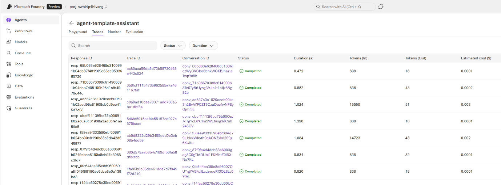
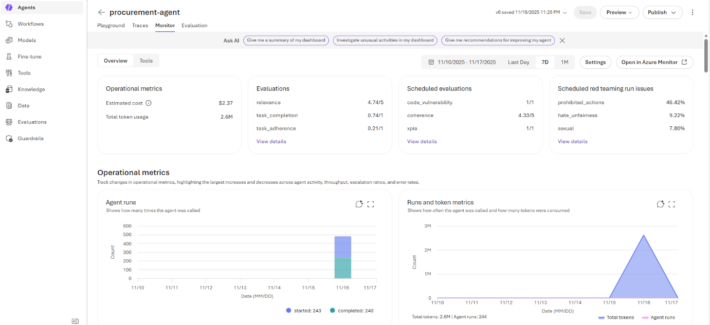

## Usecase 07- Safeguard your agents with AI Red Teaming Agent in Microsoft Foundry

**Scenario**

Zava is a fast-growing technology and services company that manages
large volumes of internal documentation, product manuals, training
material, and customer-support knowledge. Employees frequently need
quick, accurate responses without manually searching through dozens of
files and knowledge repositories.

To improve efficiency, Zava wants to deploy an intelligent AI-powered
assistant that can read, understand, and retrieve answers from its
internal documents. The company chooses Azure AI Agent Service to build
an interactive chat interface, where employees can simply ask a question
and receive a precise, citation-supported answer grounded in Zava’s
internal knowledge.

**Introduction**

As organizations adopt AI agents to automate workflows, answer
questions, and retrieve internal knowledge, ensuring these systems
behave safely and reliably becomes critical. Zava, a fast-growing
technology company, is deploying an internal AI knowledge assistant to
help employees quickly retrieve information from documents, manuals, and
training materials. To protect this AI agent against harmful behavior,
security gaps, or unintended responses, Zava leverages Microsoft
Foundry’s AI Red Teaming capabilities.  
This use case demonstrates how to build a secure end-to-end AI agent,
evaluate its behavior, detect risks through automated red teaming, and
monitor its performance using Azure’s observability tools. Through
guided steps, you will deploy the agent, test its retrieval
capabilities, run red teaming evaluations, and enforce continuous
monitoring to ensure safety, accuracy, and compliance.

**Objectives**

- Understand how to build a document-aware AI knowledge assistant using
  Azure AI Agent Service.

- Deploy Azure resources and configure the full solution using Azure
  Developer CLI.

- Interact with the AI agent using predefined and custom prompts to
  validate retrieval accuracy.

- Execute built-in evaluators to measure agent quality, safety, intent
  resolution, and tool-call correctness.

- Run automated AI Red Teaming tests to identify vulnerabilities,
  harmful behaviors, or safety violations.

- Analyze red teaming results in Microsoft Foundry, including attack
  strategies and failure cases.

- Enable tracing, monitoring, and continuous evaluation to track
  real-time agent behavior in production.

- Learn best practices for securing AI agents through consistent
  testing, observability, and model governance.

## Task 0: Understand the VM and the credentials

In this task, we will identify and understand the credentials that we
will be using throughout the lab.

1.  **Instructions** tab hold the lab guide with the instructions to be
    followed throughout the lab.

2.  **Resources** tab has got the credentials that will be needed for
    executing the lab.

    - **URL** – URL to the Azure portal

    - **Subscription** – This is the ID of the subscription assigned to
      you

    - **Username** – The user id with which you need to login to the
      Azure services.

    - **Password** – Password to the Azure login. Let us call this
      Username and password as Azure login credentials. We will use
      these creds wherever we mention Azure login credentials.

    - **Resource Group** – The **Resource group** assigned to you.

3.  **Help** tab holds the Support information. The **ID** value here is
    the **Lab instance ID** which will be used during the lab execution.

> 

\[!Alert\] **Important:** Make sure you create all your resources under
this Resource group

## Task 1: Register Service provider

1.  Open a browser go to +++https://portal.azure.com+++ and sign in with
    your cloud slice account below.

Username: <+++@lab.CloudPortalCredential>(User1).Username+++

Password: <+++@lab.CloudPortalCredential>(User1). *TAP*+++

1.  Click on **Subscriptions** tile.

2.  Click on the subscription name.

3.  Expand Settings from the left navigation menu. Click on **Resource
    providers**, enter **+++** **Microsoft.CognitiveServices+++** and
    select i,t, and then click **Register**.

> 

4.  Repeat the steps \#4 to register the following Resource provider.

- +++**Microsoft.AlertsManagement**+++

## Task 2: Retrieve resource group name and location

1.  Type in +++**Resource group+++** in the search bar and
    select **Resource groups**.

> 

2.  Click on your assigned **Resource group**.

> 

3.  In **Resource group** page, copy **resource group name and
    location** and paste them in a notepad, then **Save** the notepad to
    use the information in the upcoming tasks.

> 

## Task 3: Open Github Codespaces environment

1.  Open your browser, navigate to the address bar, type or paste the
    following URL: +++ https://github.com/technofocus-pte/aiagents+++

2.  Click on **fork** to fork the repo. Give unique name to the repo and
    click on **Create repo** button.

3.  Click on **Create fork**

4.  Click on **Code -\> Codespaces -\> Codespaces+**

4.  Wait for the Codespaces environment to setup .It takes few minutes
    to setup completely

## Task 4: Provision Services and deploy application to Azure

1.  Run the following command on the Terminal. It generates the code to
    copy. Copy the code and press Enter.

+++azd auth login+++

2.  Default browser opens to enter the generated code to verify. Enter
    the code and click **Next**.

3.  Sign in with your Azure credentials.

4.  To create an environment for Azure resources, run the following
    Azure Developer CLI command.It asks you to enter environment name
    .Enter any name of your choice and press enter (eg
    :+++aiagentXXXX+++)

**Note:** When creating an environment, ensure that the name consists of
lowercase letters.

+++azd env new+++

5.  Run below command to provision the services to Azure, build your
    container.

+++azd env set AZURE_RESOURCE_GROUP {Name of existing resource group}+++

6.  Run azd up - This will provision Azure resources

+++azd up+++

7.  Select below values.

- **Select an Azure Subscription to use** : Select your subscription

- **azureAiServiceLocation**: Sweden Central

4.  This deployment will take *7-10 minutes* to provision the resources
    in your account and set up the solution with sample data.

5.  Now the deployment is complete

6.  After the application has been successfully deployed, you see a URL
    displayed in the terminal. Copy the **URL**

## Task 5: Verify deployed resources in the Azure portal

1.  Select **Resource groups**

2.  Click on your assigned **Resource group**.

3.  Make sure the below resource got deployed successfully

- Foundry

- Foundry project

- Container App

- Container registry

- Container App Environment

- Azure Cosmos DB account

- Search service

- Azure Storage account

4.  On the resource group and click on **Azure Storage account.**

5.  From the left navigation menu, click on **Containers** , Make sure
    data should be deployed successfully

6.  Go back to resorcegroup and click on **Foundry Project.**

> 

7.  Click **Go to Foundry portal** to verify that the model has been
    successfully deployed.

8.  In the top navigation, select **Build**

9.  In the left-hand menu, select **Agents.** Locate your agent in the
    list - the agent name and version will be displayed

10. The Agent ID follows the
    format: {agent_name}:{agent_version} (e.g., agent-template-assistant:1).
    Copy the Agent ID in a notepad

## Task 6: Interact with Your AI Agent Using Predefined Questions

1.  Go back to GitHub Codespaces and select the **Endpoint URL**.

> 

2.  Click on **Open** button

> 

3.  Wait for the web application deployment to complete.

> 

2.  In the **agent-template-assistant** web app page, enter the
    following text and click on the **Submit icon** as shown in the
    below image.

**+++What's the best tent under $200 for two people, and what features
does it include?+++**

3.  In the **agent-template-assistant** web app page, enter the
    following text and click on the **Submit icon** as shown in the
    below image.

> +++ What has David Kim purchased in the past, and based on his buying
> patterns, what other products might interest him?+++

> +++ Compare hiking boots from different brands in your inventory -
> which ones offer the best value for durability and comfort?+++

+++How do I set up the Alpine Explorer Tent, and what should I know
about its weather protection features?+++

4.  In the **agent-template-assistant** web app page, enter the
    following text and click on the **Submit icon** as shown in the
    below image.

+++ I'm planning a 3-day camping trip for my family. What complete setup
would you recommend under $500, and why?+++

## Task 7: Sample Prompts for Azure AI Search

1.  In the **agent-template-assistant** web app page, select New Chat

2.  In the **agent-template-assistant** web app page, enter the
    following text and click on the **Submit icon** as shown in the
    below image.

+++ Which products have wireless charging capabilities and what are
their battery life specifications?+++

> +++Find products designed for comfort and temperature control - what
> features do they offer?+++
>
> +++What care and maintenance instructions are available for electronic
> products with waterproof features?+++

## Task 8: Agent Evaluation

Azure AI Foundry offers a number of built-in evaluators to measure the
quality, efficiency, risk and safety of your agents. For example, intent
resolution, tool call accuracy, and task adherence evaluators are
targeted to assess the end-to-end and tool call process quality of agent
workflow, while content safety evaluator checks for inappropriate
content in the responses such as violence or hate. You can also create
custom evaluators tailored to your specific requirements, including
custom prompt-based evaluators or code-based evaluators that implement
your unique assessment criteria.

1.  Go back to GitHub Codespaces, open the terminal, and run the Python
    requirements script below to set up your environment

+++python -m pip install -r src/requirements.txt+++

2.  Run the below script to set the variable

+++export AZURE_AI_AGENT_DEPLOYMENT_NAME="gpt-5-mini"+++

+++pytest tests/test_evaluation.py -s+++

3.  Upon completion, the test will display an URL in the output where
    you can review the detailed evaluation results in the Azure AI
    Foundry UI, including individual evaluator passing scores and
    explanations.

4.  Click on the **Open**

## Task 9: AI Red Teaming Agent

The AI Red Teaming Agent is a powerful tool designed to help
organizations proactively find security and safety risks associated with
generative AI systems during design and development of generative AI
models and applications.

In the red teaming test script, you will be able to set up an AI Red
Teaming Agent to run an automated scan of your agent in this sample. The
test demonstrates how to:

- Create a red-teaming evaluation

- Generate taxonomies for risk categories (e.g., prohibited actions)

- Configure attack strategies (Flip, Base64) with multi-turn
  conversations

- Retrieve and analyze red teaming results

No test dataset or adversarial LLM is needed as the AI Red Teaming Agent
will generate all the attack prompts for you.

1.  Run the below script to set the variable

+++export AZURE_EXISTING_AGENT_ID="agent-template-assistant:1"+++

2.  Run the red teaming test in your local development environment:

+++pytest tests/test_red_teaming.py -s+++

3.  Upon completion, the test will display an URL in the output where
    you can review the detailed red teaming evaluation results in the
    Microsoft Foundry UI, including attack inputs, outcomes, and
    reasons.

4.  Click on **Open** button

## Task 10: Tracing and monitoring

1.  Enable tracing by setting the environment variable

> +++azd env set ENABLE_AZURE_MONITOR_TRACING true+++

2.  Deploy the resources

> +++azd deploy+++

## Task 11: Console traces

1.  You can view console traces in the Azure portal. You can get the
    link to the resource group with the azd tool:

> +++azd show+++

Or if you want to navigate from the Azure portal main page, select your
resource group from the 'Recent' list, or by clicking the 'Resource
groups' and searching your resource group there.

After accessing your resource group in Azure portal, choose your
container app from the list of resources. Then open 'Monitoring' and
'Log Stream'. Choose the 'Application' radio button to view application
logs. You can choose between real-time and historical using the
corresponding radio buttons. Note that it may take some time for the
historical view to be updated with the latest logs.

## Task 12: Agent traces and Monitor

You can view both the server-side and client-side traces, cost and
evaluation data in Microsoft Foundry.

1.  Go back the Microsoft Foundry and select agent.

2.  Select the **Traces**

> 

3.  Once App Insights is connected to your foundry project, you can also
    visit the monitoring dashboard to view trends such as agent runs and
    tokens count, error rates, evaluation results, and other key metrics
    that help you monitor agent performance and usage.

## Task 13: Continuous Evaluation

Continuous evaluation is an automated monitoring capability that
continuously assesses your agent's quality, performance, and safety as
it handles real user interactions in production.

During container startup, continuous evaluation is enabled by default
and pre-configured with a sample evaluator set to evaluate up to 5 agent
responses per hour. Continuous evaluation does not generate test
inputs—instead, it evaluates real user conversations as they occur. This
means evaluation runs are triggered only when actual users interact with
your agent, and if there are no user interactions, there will be no
evaluation entries.

To customize continuous evaluation from the Azure AI Foundry:

1.  Select **Monitor.** Choose the agent you want to enable continuous
    evaluation for from the agent list and click on **Settings**

> 

2.  Select evaluators and adjust maximal number of runs per hour and
    click on **Submit** button

> 
>
> 

## Task 14: Delete the resources

1.  From the Azure portal home page, select the assigned Resouce group.
    Select all the resources under the Resource group and select Delete.

2.  Enter +++**delete**+++ and click on the **Delete** button to confirm
    deletion. Click on **Delete** in the Delete confirmation dialog box.

3.  Confirm the deletion of all the resources with a success message.

**Summary**

In this use case, you built and secured an AI agent capable of
retrieving information from Zava’s internal documents using Azure AI
Agent Service. After deploying the environment and verifying key
resources—including Container Apps, Azure Cosmos DB, Storage, Search,
and Foundry—you interacted with the agent to test its ability to answer
operational and product-related queries. You then performed automated
evaluations using Microsoft Foundry’s assessment tools and executed
comprehensive AI Red Teaming scans to uncover potential risks. Finally,
you enabled tracing, logging, and continuous evaluation to monitor
real-world usage and ongoing model safety.  
This end-to-end workflow equips Zava with a reliable, secure, and
scalable AI assistant that provides accurate information while meeting
enterprise-grade safety and governance standards.
