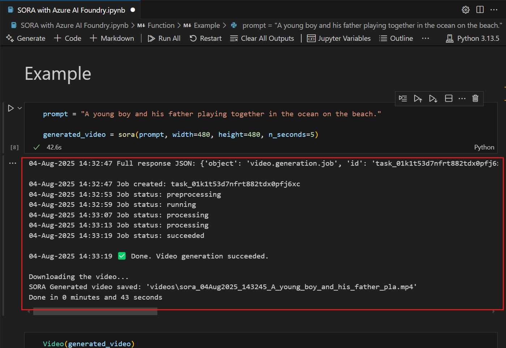
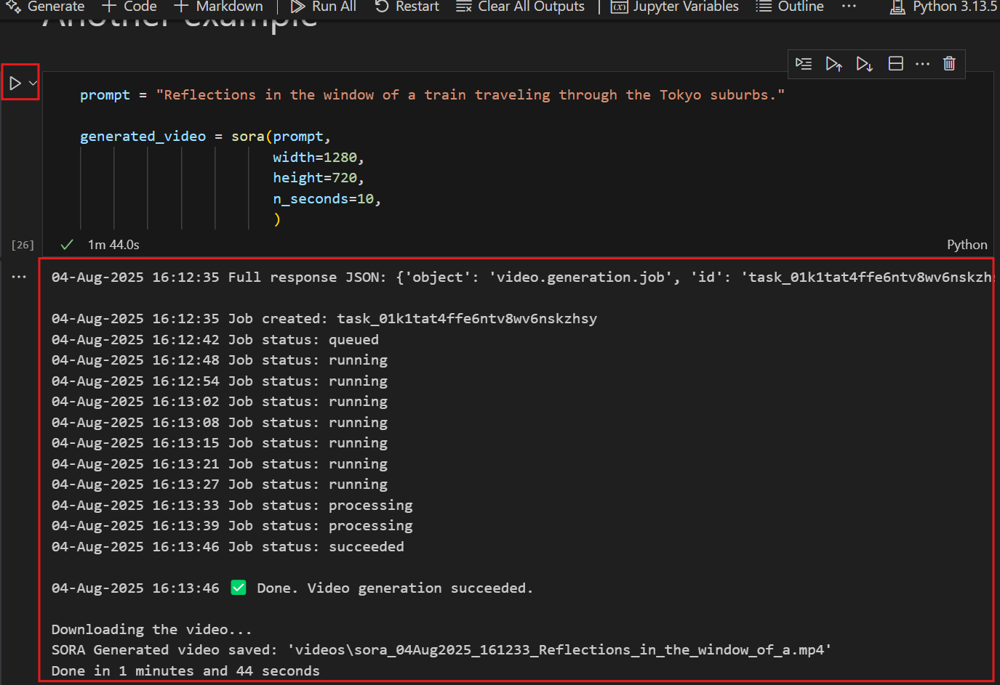
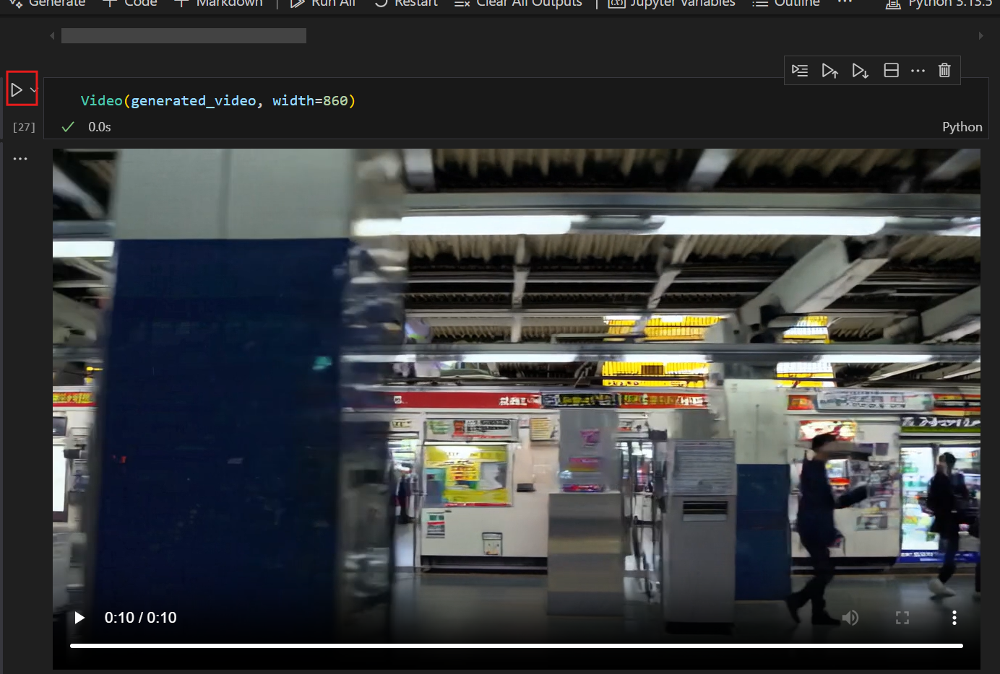
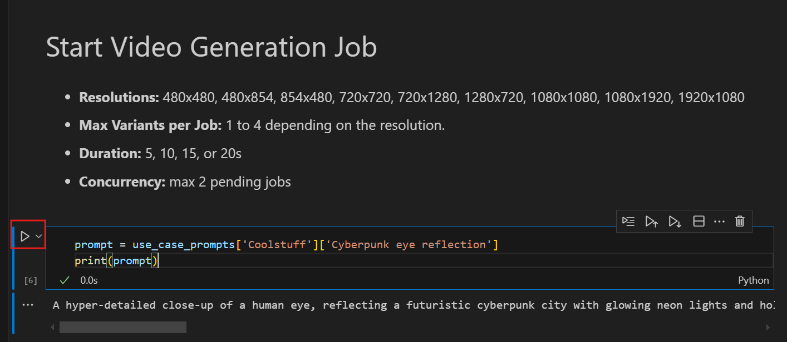

**Introduction**

This lab provides a practical overview of **Sora**, OpenAI’s advanced
text-to-video generation model, integrated with **Azure OpenAI**
services. It demonstrates how to leverage Sora within the **Azure AI
Studio** and **Azure AI Foundry** environments to generate high-quality
video content from natural language prompts. The lab covers API
configuration, prompt execution, and video retrieval, showcasing how
cutting-edge generative models can be applied in cloud-based workflows
for content creation and innovation.

**Objectives**

- Understand the fundamentals of Sora and its integration with Azure
  OpenAI.

- Set up and configure access to Azure AI Studio and the Sora API.

- Generate videos from natural language prompts using prebuilt Sora
  endpoints.

- Analyze and retrieve generated video content from API responses.

- Explore use cases for AI-generated video in business and creative
  domains.

## Task 0: Understand the VM and the credentials

In this task, we will identify and understand the credentials that we
will be using throughout the lab.

1.  Instructions tab hold the lab guide with the instructions to be
    followed throughout the lab.

2.  Resources tab has got the credentials that will be needed for
    executing the lab.

- URL – URL to the Azure portal

- **Subscription – This is the ID of the subscription assigned to you**

- **Username – The user id with which you need to login to the Azure
  services.**

- **Password – Password to the Azure login. Let us call this Username
  and password as Azure login credentials. We will use these creds
  wherever we mention Azure login credentials.**

- **Resource Group – The Resource group assigned to you.**

**\[!Alert\] Important: Make sure you create all your resources under
this Resource group**

3.  Help tab holds the Support information. The ID value here is the Lab
    instance ID which will be used during the lab execution.

##  Task 1 : Register Service provider

1.  **Open a browser go to +++ sign in with your cloud slice account
    below.**

- **Username: <+++@lab.CloudPortalCredential>(User1).Username+++**

- **Password: \<<+++@lab.CloudPortalCredential>(User1).Password\>+++**

> 

4.  Click on Subscriptions tile.

5.  Click on the subscription name.

6.  Expand Settings from the left navigation menu. Click on Resource
    providers, enter +++**Microsoft.AlertsManagement**+++ and select it,
    and then click Register.

7.  Click on Resource providers,
    enter +++**Microsoft.DBforPostgreSQL**+++ and select i,t, and then
    click Register.

8.  Repeat the steps \#10 and \#11 to register the following Resource
    providers.

- **Microsoft.Search**

- **Microsoft.Web**

- **Microsoft.ManagedIdentity**

## Task 2: Create Azure OpenAI resource

1.  In Azure portal, search box, type **+++Microsoft Foundry+++** and
    then click on the Microsoft Foundry.

2.  In Azure AI Foundry page , select **Azure OpenAI** under the **Use
    with AI Foundry**

3.  Click on **+Create Azure OpenAI**

4.  In the Create Azure OpenAI window, under the Basics tab, enter the
    following details and click on the **Next** button.

&nbsp;

1)  Subscription: Select the assigned subscription

2)  Resource group:  Select the assigned Resource group

3)  Region: For this lab, you will use a  **SORA** model. This model is
    currently only available in [certain
    regions](https://learn.microsoft.com/azure/ai-services/openai/concepts/models#embeddings-models).
    Please select a region from this list, In this lab East US 2 is
    using for this resource.

4)  Name: aoaisoraXXXXX (XXXXX can be Lab instant ID)

5)  Pricing tier: Select Standard S0

Note: To find your lab instant ID, select 'Help' and copy the instant
ID.

5.  In the Network tab, leave all the radio buttons in the default
    state, and click on the **Next** button.

6.  In the Tags tab, leave all the fields in the default state, and
    click on the **Next** button.

7.  In the **Review + submit** tab, once the Validation is Passed, click
    on the **Create** button.

8.  Wait for the deployment to complete. The deployment will take around
    2-3 minutes.

&nbsp;

9.  On Microsoft.CognitiveServicesOpenAI window, after the deployment is
    completed, click on Go to resource button.

10. In the Overview section of the **Azure OpenAI home** page, copy the
    **Azure OpenAI** **resource name** and save them in a notepad.

11. Click on **Keys and Endpoints** from the left navigation menu and
    then copy the endpoint value in a notepad to **AzureAI
    ENDPOINT** and **key** to a variable AzureAIKey.

12. On the aoaisoraXXXXX window, click on Overview in the left-sided
    navigation menu, scroll down to Explore and deploy tile and click
    on Explore Azure AI Foundry portal button as shown in the below
    image to open Azure AI Foundry portal in a new browser.

## Task 3: Deploying an Azure OpenAI model Sora

1.  On the **Azure AI Foundry** **| Azure Open AI Service** homepage,
    navigate to Components section and click on Deployments.

2.  In the Deployments window, drop down the +Deploy model and
    select Deploy base model.

3.  In the Select a model dialog box, navigate and carefully
    select **sora**, then click on **Confirm** button.

4.  In the Deploy model **sora** dialog box, under the Deployment
    name field, ensure that **sora**, select the Deployment type
    as **Standard**. Then click on the **Deploy** button.

5.  In the Deployments window, drop down the **+Deploy model** and
    select **Deploy base model.**

> 

6.  In the Select a model dialog box, navigate and carefully
    select **gpt-4.1**, then click on **Confirm** button.

> 

7.  In the Deploy model **gpt 4.1** dialog box, under the Deployment
    name field, ensure that **gpt 4.1**, select the Deployment type
    as Global **Standard**. Then click on the **Deploy** button.

> 

> 

## Task 4: Generate AI-Powered Videos Using Sora with Azure AI Foundry

1.  In your Windows search box, type Visual Studio, then click on Visual
    Studio Code.

> 

2.  In the Visual Studio Code editor, click on File, then navigate and
    click on Open Folder.

> 

8.  Navigate and select **sora** folder from C**:\LabFiles** and click
    on the **Select** **Folder** button.

9.  If you see a dialog box - **Do you trust the authors of the files in
    this folder?**, then click on **Yes, I trust the author**.

10. In Visual Studio Code dropdown the **SORA** and select **SORA with
    Azure AI Foundry.ipynb** notebook.

11. In the main page of Visual Studio Code editor, scroll down
    to **install requirements** heading and run the 1^(st) cell. If
    prompted to select the environment, then select **Python
    Environments** as shown in the image.

12. If prompted to select the path, then select the **Python version
    3.13.1 or later version** path as shown in the image.

## Task 5: Create Videos with the Azure OpenAI Sora API

1.  In your Windows search box, type Visual Studio, then click on Visual
    Studio Code.

> 

2.  In the Visual Studio Code editor, click on File, then navigate and
    click on Open Folder.

> 

3.  Navigate and select **visionary-lab** folder
    from C**:\LabFiles** and click on the **Select** **Folder** button.

